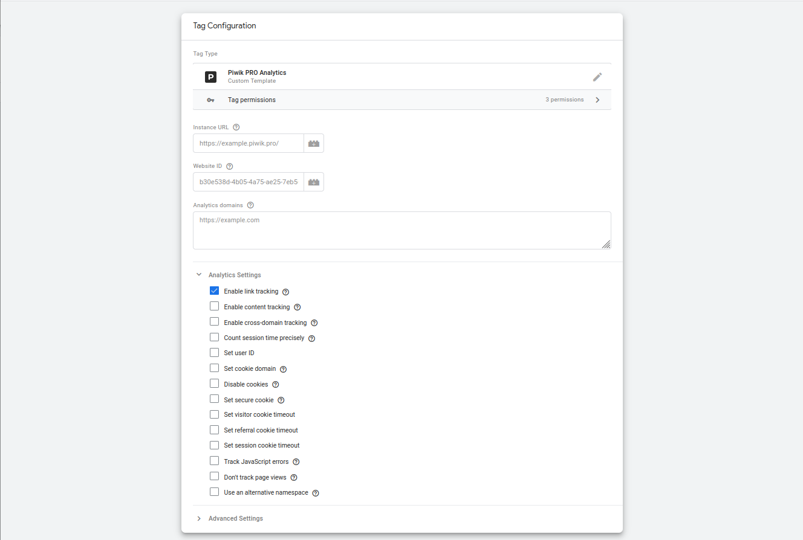

# Piwik PRO Analytics template for Google Tag Manager

Analyze the customer journey across websites and apps.

A documentation can be found in this [Piwik PRO Help center article](https://help.piwik.pro/support/getting-started/google-tag-manager-install-a-tracking-code/).



## Release Notes
The following changes and enhancements were intruduced since the initial template version: 

### Tag Configuration 
- *"Site or app address"*: fixed input format (no https://) and enabled comma-separated lists for multiple hosts or domains
- you can use a constant to populate the *"Site or app address"* field now when using multiple tags (field type was changed)
- New settings in the *Other options* block to support the following features:
  - *"Use custom tracker URL"* enables the use of a custom endpoint like the Piwik **PRO First Party Collector** or **server-side Google Tag Manager**
  - *"Override event URL*" can be used to change the URL that gets sent with the current hit, *"Custom document title"* does the same for the title (can be used to pick a title from a `dataLayer` instead of the regular title in the browser)  

### Google Consent Mode & Privacy Settings
The *"Use visitor cookies"* option format was changed from checkbox to a drop-down including variables. This enables you to set this option depending on current consent.

The new option to *"Enable Strict Privacy Mode"* can be set in the same way, so the same tag can be used either with or without consent with dynamic pricacy settings.

Both options can be controlled by the Google Consent Mode flag `analytics_storage` when *"Follow Google Consent Mode"* is activated. If active, the other two options are hidden and automatically set according to the current Consent Mode status when fired.     

### Multiple "Tracking Types"
Additional to the standard init and pageview, the new template supports the full set of Piwik PRO hits and events:

- Pageview (default)
- Init only (no pageview)
- Goal
- Event
- Ecommerce (-> [Ecomerce Support](#ecommerce-support))
- Site search
- Virtual pageview
- Content impression
- Content interaction
- Link
- Set Dimension
- Delete Dimension

Depending on the selected *"Tracking type"* you can define hit specific parameters.

### Event-scoped dimensions
You can optionally define event-scoped custom dimensions when sending an *Event*, *Goal*, *Site search* or *Link*. Those dimensions will only apply to the current hit. To define a custom dimension, add a new row to the table and enter the ID (index) of the dimension defined for your website and pick a variable or enter a constant string as dimension value.  

### Ecommerce Support
The template can send all types of Piwik PRO ecommerce events (ecommerce v2): 

- ProductDetailView
- AddToCart
- RemoveFromCart
- CartUpdate
- Order

You can add product data by providing an array (like *`ecommerce.items`*) and mapping object keys to the according Piwik PRO product structure or define all parameters of a single item manually. 

#### Custom Product Dimensions
If you want to add dimensions to a product, add them either to the source array or for a single item (as result of a custom JavaScript variable) in the following format: 

```
{
    1: "Dimension Value 1 here",
    2: "Another Dimension",
    5: "Yes"
}
```
#### Auto-Detect Ecommerce
When your website provides an ecommerce `dataLayer` in a format suitable for Google Analytics (Universal or GA4) and the event names match the GA4 ecommerce standard event scheme (like `view_item`, `add_to_cart`, `remove_from_cart` and `purchase`), you can use the option **Auto detect from dataLayer event** to populate all parameters without manual configuration. 

If you still use a Universal Analytics `dataLayer`, the most recent ecommerce type containing a `products` key (`purchase`, `remove`, `add` or `detail`) will define the ecommerce event type if the current `dataLayer` event name does not match the GA4 standard names described above.  